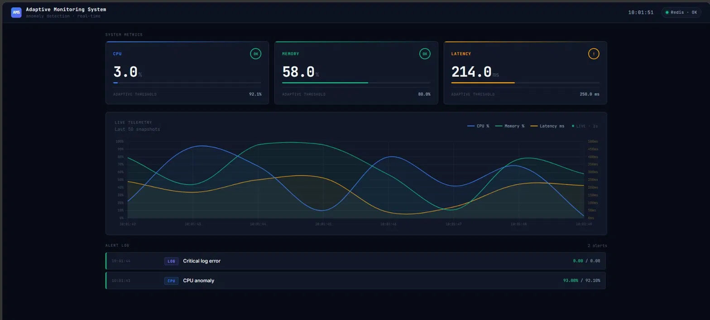

# Adaptive Real-Time Monitoring System

A production-grade distributed monitoring pipeline that detects anomalies in system metrics using an adaptive EWMA (Exponentially Weighted Moving Average) algorithm — no fixed thresholds, no manual tuning.




---

## What It Does

- Streams CPU, memory, and latency metrics from a compiled C++ binary
- Detects anomalies using a self-adjusting EWMA threshold (no static numbers)
- Routes alerts through Redis pub/sub for decoupled, real-time delivery
- Displays everything on a live dashboard with Chart.js — auto-refreshes every 2 seconds
- Exposes a Prometheus scrape endpoint for observability

---

## Architecture

```
C++ Metrics Binary
       │
       ▼
Python Monitor (EWMA Analyzer)
       │
       ├──► Redis Pub/Sub (channel: "alerts")
       │           │
       │           ▼
       │    Node.js Webhook Server
       │           │
       │           ├──► GET /alerts   (alert log)
       │           ├──► GET /metrics  (raw metrics)
       │           ├──► GET /health   (system status)
       │           └──► GET /prometheus (scrape endpoint)
       │
       └──► POST /metric → Node.js (feeds live chart)

Log Generator (Python) ──► app.log ──► Python Monitor (log watcher)
```

All services run in isolated Docker containers and communicate over a shared Docker network.

---

## Tech Stack

| Layer | Technology | Purpose |
|---|---|---|
| Metrics source | C++ (GCC 13) | High-performance metric generation |
| Anomaly detection | Python 3.11 (EWMA) | Adaptive threshold calculation |
| Message broker | Redis 7 (pub/sub) | Decoupled alert delivery |
| Webhook server | Node.js 20 + Express | Alert ingestion + API + dashboard serving |
| Dashboard | Vanilla JS + Chart.js | Live telemetry visualization |
| Orchestration | Docker Compose | Multi-container lifecycle management |

---

## How the EWMA Algorithm Works

Traditional monitoring fires alerts when a value crosses a fixed threshold (e.g. CPU > 80%). This causes alert storms on bursty systems and misses slow degradation.

This system uses **Exponentially Weighted Moving Average** with a configurable sigma multiplier:

```
mean  = mean + α × (value − mean)
var   = (1 − α) × (var + α × (value − mean)²)
threshold = mean + σ × √var
```

- `α = 0.3` — weights recent data more heavily
- `σ = 1.5` — fires when value is 1.5 standard deviations above the rolling mean
- The threshold rises and falls automatically with the signal — no tuning required

---

## Project Structure

```
monitoring_system_clean/
├── core/
│   ├── analyzer.py        # EWMA algorithm + SignalAnalyzer
│   ├── dispatcher.py      # Priority queue + Redis pub/sub + webhook fallback
│   ├── orchestrator.py    # Wires analyzer to dispatcher
│   ├── monitor.py         # Main entry point + threads
│   └── cli.py             # Argument parsing
├── generator/
│   └── log_generator.py   # Simulates application logs (INFO/WARNING/ERROR)
├── metrics_cpp/
│   └── metrics.cpp        # C++ binary: outputs cpu,memory,latency per second
├── webhook_server/
│   └── server.js          # Express server: Redis subscriber + REST API
├── dashboard/
│   └── index.html         # Live dashboard (Chart.js, vanilla JS, dark theme)
├── config/
│   └── config.json        # Runtime config (alpha, cooldown, webhook URL)
├── tests/
│   └── test_analyzer.py   # Unit tests for EWMA and SignalAnalyzer
├── .github/workflows/
│   └── ci.yml             # GitHub Actions: lint + test + Docker build smoke test
├── Dockerfile.python
├── Dockerfile.cpp
├── Dockerfile.node
└── docker-compose.yml
```

---

## Quick Start

**Prerequisites:** Docker Desktop installed and running.

```bash
git clone https://github.com/DonaRashmitha-dev/adaptive_real_time_monitoring_system.git
cd monitoring_system_clean
docker compose up --build
```

Then open:

| URL | What you see |
|---|---|
| `http://localhost:3000` | Live dashboard |
| `http://localhost:3000/alerts` | Raw alert JSON |
| `http://localhost:3000/metrics` | Raw metrics JSON |
| `http://localhost:3000/health` | System health + Redis status |
| `http://localhost:3000/prometheus` | Prometheus scrape endpoint |

---

## Configuration

Edit `config/config.json`:

```json
{
  "adaptive_window": 5,
  "alert_cooldown": 5,
  "webhook_url": "http://webhook:3000/alert"
}
```

| Field | Default | Description |
|---|---|---|
| `adaptive_window` | 5 | EWMA window size |
| `alert_cooldown` | 5 | Seconds before the same alert can re-fire |
| `webhook_url` | internal | Alert delivery endpoint |

---

## Running Tests

```bash
pip install pytest
pytest tests/ -v
```

CI runs automatically on every push to `main` via GitHub Actions — lints Python with flake8, runs pytest, then builds all Docker images and smoke-tests the webhook container.

---

## Key Engineering Decisions

**Why Redis pub/sub instead of direct HTTP?**
Decouples the Python monitor from the Node webhook. The monitor doesn't care if the webhook is slow or down — it publishes and moves on. The webhook subscribes and processes independently.

**Why C++ for metrics?**
Demonstrates polyglot architecture. In real systems, metric collection agents are often written in C/C++/Go for low overhead. Python reads from its stdout pipe — standard Unix IPC.

**Why no fixed thresholds?**
Random metric data has no meaningful static threshold. EWMA adapts to the baseline of whatever signal it's watching — the same algorithm used in TCP congestion control and financial time series.
## Why I Built This

This system is Layer 1 of a three-part observability stack built from scratch.

**Layer 1 — This repo:** Adaptive anomaly detection. Detects *when* something breaks.

**Layer 2 — Fault Injection Platform:** Deliberately crashes processes, starves memory,
spikes CPU. Measures recovery time. Answers: *how bad does it get?*

**Layer 3 — LOG.INTEL:** AI-powered log intelligence. Ingests output from both systems,
runs RAG over log history, answers questions about system health in plain English.
Answers: *why did it break?*

Each layer was designed to feed the next. The stack reflects how production observability
actually works — detect, stress-test, then understand.
